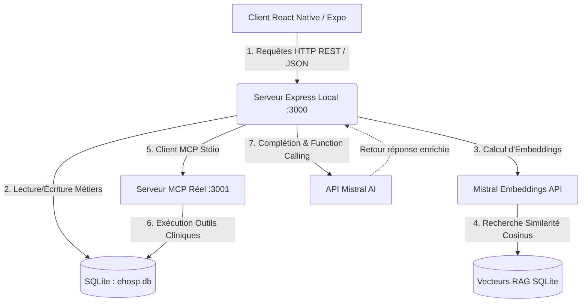

# 🏥 eHosp - Local Enterprise AI Architecture

eHosp est une architecture d'application médicale mobile de pointe, conçue pour démontrer la faisabilité et la puissance d'une solution de santé **100% locale, souveraine et hautement sécurisée (Zero-Cloud)** sur Mac et iPhone. 

Ce projet a été développé en combinant les dernières technologies d'IA générative : l'**API Mistral AI** (technologie souveraine française), un pipeline de **RAG vectoriel réel** (calculé localement) et le protocole standardisé **MCP (Model Context Protocol)** d'Anthropic pour connecter le LLM aux données métiers et outils d'entreprise.

---

## 🛠️ Architecture du Système

Le système est découplé en un client mobile réactif au design premium "Revolut-like" et un serveur d'orchestration agentique local :



### Points Clés de l'Architecture
1. **Stockage Local Intégral :** Bypassement total des services cloud externes (ex: Firebase). Toutes les données (profils de santé, historiques de chat, messages, consultations, médecins) sont hébergées en local dans une base de données **SQLite réelle** (`ehosp.db`) gérée nativement par le runtime Node.js (sans dépendance binaire externe lourde).
2. **RAG Vectoriel Réel :** Les guides cliniques de la HAS (Haute Autorité de Santé) sont découpés et stockés dans la base. Une recherche par similarité cosinus réelle est effectuée via l'API `mistral-embed` de Mistral AI au démarrage et lors de chaque message utilisateur pour contextualiser les réponses de l'IA (Grounding clinique).
3. **Protocole MCP Réel (Model Context Protocol) :** Un serveur MCP indépendant est lancé en sous-processus stdio. Il expose 4 outils normalisés permettant au LLM d'agir en autonomie sur le système d'information de l'hôpital (consulter les plannings, réserver des consultations, modifier des dossiers patients).
4. **Design Revolut-style & Gratuité :** Interface mobile sombre premium, avec des effets de transparence (glassmorphism), des micro-animations réactives et un contournement total des verrous d'abonnement pour une démonstration fluide et 100% gratuite.

---

## 📂 Structure du Code source

* `/src` : Client mobile React Native (Expo)
  * `/src/services/FirebaseService.ts` : Intercepteur transparent redirigeant les requêtes Firebase vers l'API SQLite locale.
  * `/src/ai/AgentOrchestrator.ts` : Orchestrateur client envoyant les prompts au backend et simulant un streaming fluide token-par-token.
  * `/src/screens/chat/ChatScreen.tsx` : Interface de discussion avec sélecteurs de spécialistes (Cardiologue, Dermatologue, etc.) et bandeaux d'urgence.
* `/server` : Serveur d'orchestration et de données (Express)
  * `index.js` : Point d'entrée de l'API Express, client MCP et pipeline de chat agentique.
  * `mcp-server.js` : Serveur MCP implémentant le protocole standardisé et les outils.
  * `database.js` : Gestionnaire de base de données SQLite utilisant le module natif et performant de Node.js v22+.
  * `rag.js` : Moteur d'indexation vectorielle RAG et de recherche par similarité cosinus.
  * `/rag_documents/` : Fiches de protocoles officiels de la HAS (Urgences, Diabète, HTA).

---

## 🔧 Installation et Lancement local

### Prérequis
- **Node.js v22.5.0** ou supérieur (requis pour le module natif `node:sqlite`).
- **npm** installé.
- Une clé **API Mistral AI** valide (intégrée par défaut dans la démo).
- Pour exécuter sur iPhone : **Xcode** (macOS uniquement) ou l'application **Expo Go** (App Store).

### 1. Configuration des variables d'environnement
Créez ou modifiez le fichier `.env` à la **racine** du projet :
```env
EXPO_PUBLIC_BACKEND_URL=http://localhost:3000
EXPO_PUBLIC_LOCAL_STORAGE=true
EXPO_PUBLIC_ALL_FREE=true
EXPO_PUBLIC_MISTRAL_API_KEY=p12DgAkX2ov4j9QzayU00HyFpO8mJxDm
```

Et configurez le fichier `server/.env` dans le répertoire du serveur :
```env
PORT=3000
MISTRAL_API_KEY=p12DgAkX2ov4j9QzayU00HyFpO8mJxDm
```

### 2. Démarrage du Serveur Backend (Express + MCP + SQLite)
Ouvrez un terminal dans le dossier `server/` :
```bash
cd server
npm install
npm start
```
Le serveur va :
1. Initialiser le fichier SQLite local `ehosp.db`.
2. Vectoriser et indexer les documents HAS locaux (RAG) via Mistral Embeddings.
3. Démarrer le serveur MCP stdio.
4. Écouter sur le port `3000` pour recevoir le client mobile.

*Vous pouvez exécuter un test d'intégration autonome du serveur en lançant : `node test_pipeline.js` dans le dossier `server/`.*

### 3. Démarrage de l'Application Mobile (Expo)
Ouvrez un second terminal à la **racine** du projet :
```bash
npm install
npm run ios
```
- Pour compiler sur le simulateur iPhone de votre Mac, appuyez sur `i`.
- Pour l'exécuter sur votre **vrai iPhone**, installez l'application **Expo Go** depuis l'App Store, assurez-vous que votre Mac et votre iPhone sont sur le **même réseau Wi-Fi**, puis configurez `EXPO_PUBLIC_BACKEND_URL` avec l'adresse IP locale de votre Mac (ex: `http://192.168.1.50:3000`) et scannez le QR Code généré par le terminal.

---

## 🤖 Les Outils MCP Exposés au LLM

Au cours de la conversation, Mistral peut appeler de manière autonome et transparente les outils suivants en fonction du besoin clinique du patient :

1. `get_patient_history` : Analyse le dossier médical complet du patient (antécédents cardiaques, diabète, allergies, poids, âge, traitements actuels) pour adapter la réponse de l'IA.
2. `check_doctor_planning` : Interroge la base de données SQLite pour lister les médecins de garde d'une spécialité (ex: Cardiologue) et vérifier leur disponibilité en temps réel.
3. `search_medical_guidelines` : Effectue une recherche vectorielle sémantique dans les fiches HAS locales pour appuyer les conseils cliniques sur des recommandations officielles.
4. `create_appointment` : Planifie et pré-réserve automatiquement un rendez-vous dans la base SQLite entre le patient et le spécialiste.

---

## 💡 Scénario de Démonstration (Pitch)

Saisissez ce prompt dans le chat de l'application :
> *"J'ai une forte douleur dans la poitrine depuis ce matin. Peux-tu regarder mes antécédents et voir si je peux consulter un spécialiste aujourd'hui ?"*

**Dans la console du serveur Express, vous verrez défiler en temps réel :**
1. **Indexation RAG :** Le serveur détecte les mots-clés de douleur thoracique et extrait le protocole HAS de l'infarctus du myocarde.
2. **Appel MCP `get_patient_history` :** Mistral interroge la base SQLite et découvre que le patient a des antécédents de diabète ou d'hypertension.
3. **Appel MCP `check_doctor_planning` :** Mistral recherche des cardiologues disponibles et trouve le *Dr. Dupuis (Cardiologue)* de garde.
4. **Appel MCP `create_appointment` :** L'IA prend l'initiative d'enregistrer une consultation pré-réservée dans la base SQLite locale.
5. **Alerte d'Urgence :** Le client mobile détecte le score d'urgence de 9/10 calculé par l'IA et affiche un bandeau rouge clignotant permettant d'appeler le SAMU (15) en un clic.
